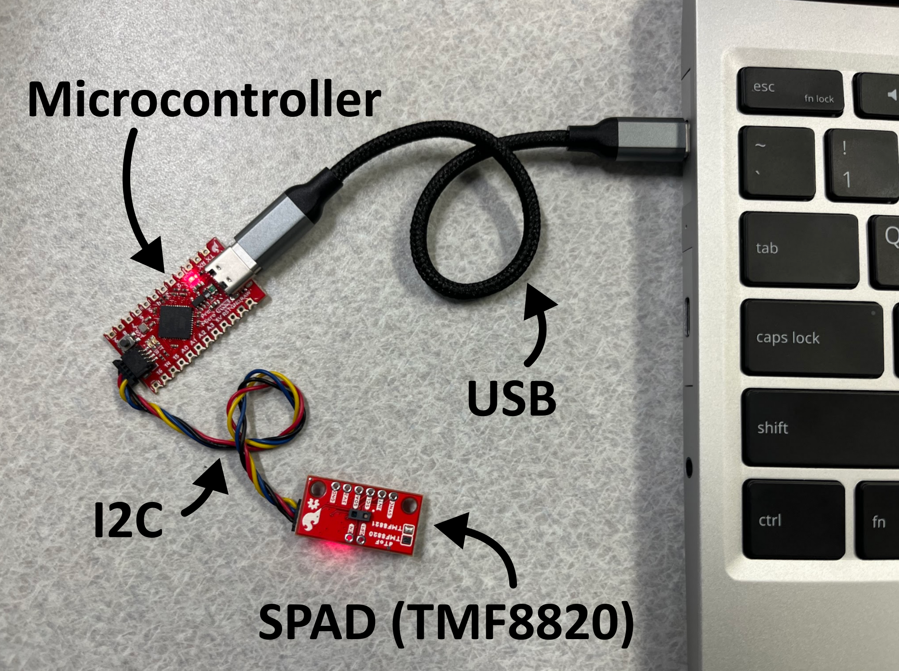

# Single Photon Imaging Hands-On Demo
Materials for hands-on portion of ICCP 2025 Summer School on Single Photon Imaging

# Getting Started
## Hardware

Assemble the hardware setup as shown below using the provided parts. The USB and I2C cables are reversible.

The following parts are provided: <br>
[AMS TMF8820 Sensor](https://www.sparkfun.com/sparkfun-qwiic-mini-dtof-imager-tmf8820.html) <br>
[SparkFun Qwiic Pro Micro](https://www.sparkfun.com/sparkfun-qwiic-pro-micro-usb-c-atmega32u4.html) <br>
[SparkFun Qwiic Cable](https://www.sparkfun.com/qwiic-cable-100mm.html) <br>
USB C to C cable



## Software
The provided microcontroller has already been flashed with [custom firmware](https://github.com/uwgraphics/ProximityPlanarRecovery/tree/main/arduino) so that it forwards on measurements from the TMF8820 to the connected computer. All you need to do is plug it in.

The `live_vis.py` and `capture.py` scripts can be used to visualize and to record data from the sensor, respectively. In order to run these scripts, you need to install the appropriate python packages. 

### Conda Installation (Preferred)
1. [Install Conda](https://www.anaconda.com/docs/getting-started/miniconda/install) if you haven't.

2. Set up the environment
```bash
conda create -n SPAD-ICCP-Summer-School python=3.12.10
conda activate SPAD-ICCP-Summer-School
conda install numpy pyqtgraph pyserial matplotlib
pip install pyqt6
```

3. Verify installation by running `live_vis.py`:
```bash
python live_vis.py
```
Note: `live_vis.py` attempts to automatically identify the device port based on your operating system. If it does not work, try passing in the port explicitly with the `--port` argument. Port names usually look like `/dev/ttyACM0` on Linux, `COM1` on Windows, or `/dev/tty.usbserial-XXXXXX` on MacOS.

Get more help identifying the port name on [Linux](https://chatgpt.com/share/6808fe22-12e0-8005-beba-8b7d0ed5c283), [Windows](https://chatgpt.com/share/6808fe89-d68c-8005-bb7b-86c932ea0d50), or [MacOS](https://chatgpt.com/share/6808fe60-f028-8005-9bc2-e4828f2be0b9).

# Activities
See separate files for instructions on [Activity 1](activity1.md) and [Activity 2](activity2.md).