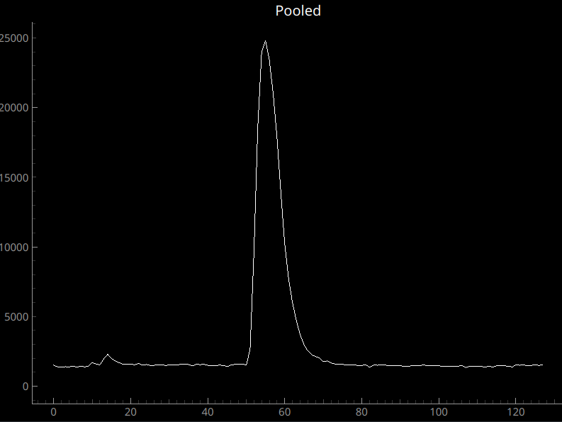
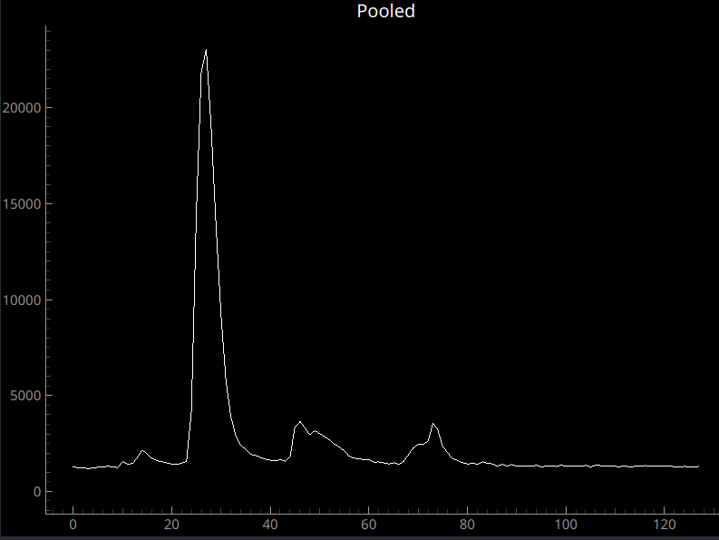
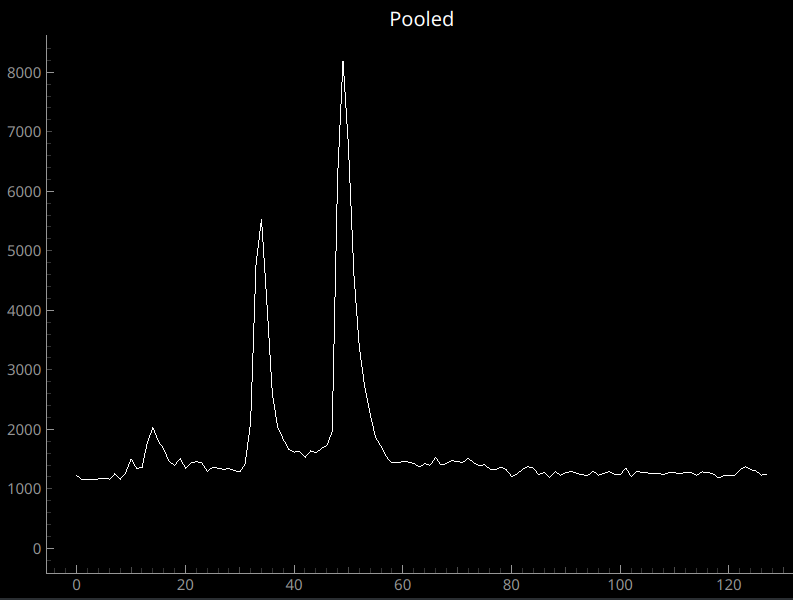
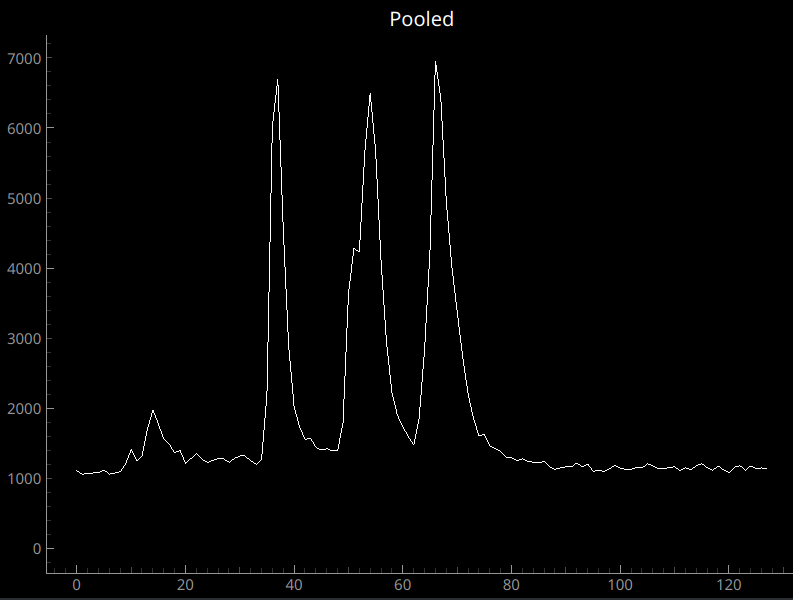
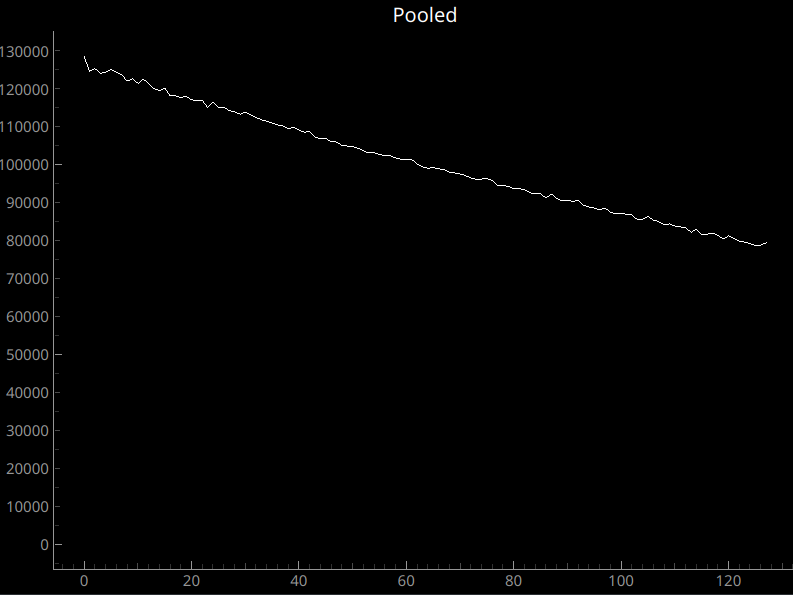

# Activity 1: Recreate Transient Histograms
Using the TMF8820 and the supplied objects, try to recreate histograms with the following characteristics. The provided images are just examples - just try to match the key features described in the text. An exact match is not necessary. Remember that we're running in pooled mode, with one big pixel, so the sensor field-of-view is somewhat wide (~33 degrees, 60mm full frame equivalent).

## 1. One peak
Capture a histogram with a single peak.

Example:

## 2. Three peaks
Capture a histogram with three distinct peaks.

Example:

## 3. Small peak, Big peak
Capture a histogram with a small peak followed by a large peak. The small peak should appear before the large peak.

Hint: the more reflective the object, the higher its corresponding peak will be.

Example:

## 4. Three same-height peaks
Capture a histogram with three distinct peaks, each of which are a similar height.

Example:

## 5. Gradual Slope
Capture a histogram with a uniform slope downwards across the entire range.

Example:

