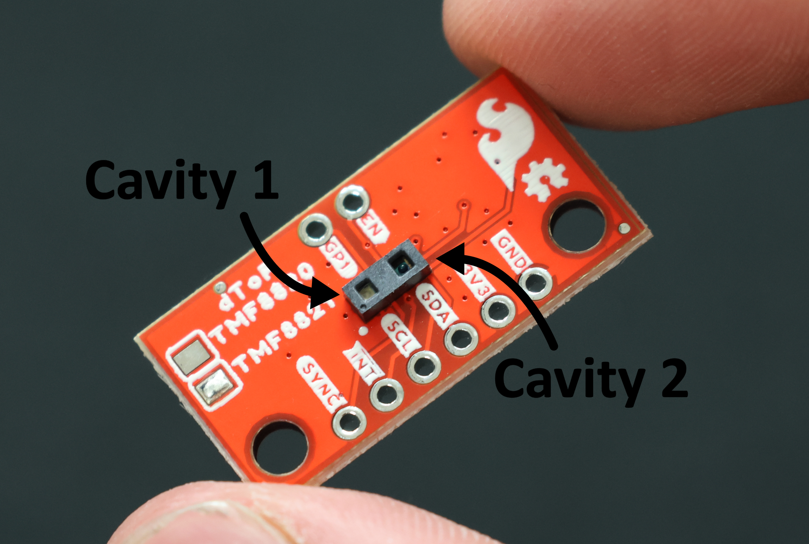

# Activity 2: Identify Laser vs. Sensor

There are two cavities onboard the TMF8820 sensor: the laser light source (behind a micro lens array), and the SPAD sensor (behind a lens). The two cavities are highlighted in the image below. Your goal in this activity is to determine which cavity is which. You are free to use any tools at your disposal.

If you are stuck, ask an instructor for a hint! Once you are confident in your assessment, you can view the solution at `part_2_active_SPADs/media/activity2/solution.png`.