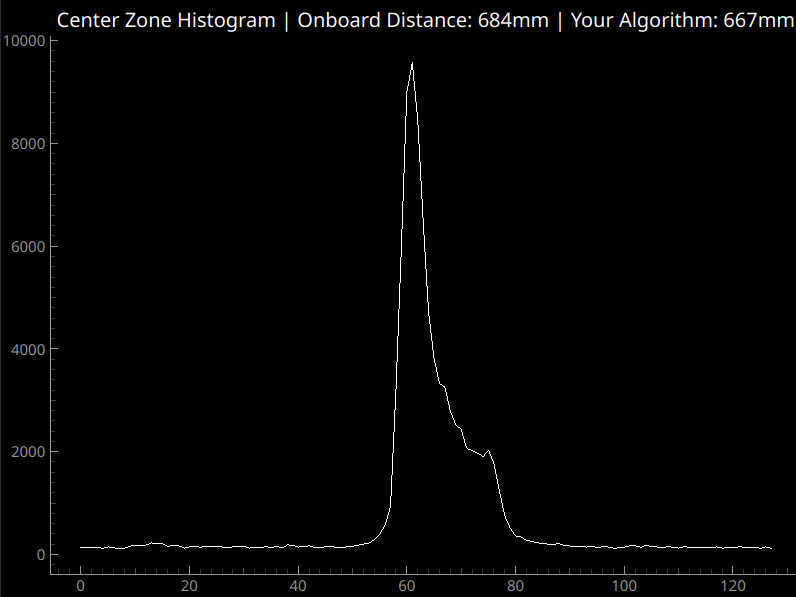

# Activity 2: Estimate Distance

Write your own algorithm for estimating the distance to the nearest object in a transient histogram by filling in the `estimate_distance` function in `activity2.py`.

## Live Test
First, test your function by running it live with the live_vis.py script. Note that this will only display the center histogram zone, so the field-of-view will be narrower than in pooled mode. This is necessary because the sensor does not report onboard distance estimates in pooled mode. Run the script with the `--estimate_distance` flag:
```bash
python live_vis.py --estimate_distance
```

You should see the distance estimate provided by your method alongside the estimate calculated onboard the sensor in the plot title, as shown below.



## Test Dataset
We have gathered a test dataset in which the sensor is positioned orthogonal to a planar surface. The ground truth distance, on-sensor distance estimates, and raw histograms are saved. You can evaluate your method against the on-sensor distance estimates by running:
```bash
python activity2.py
```